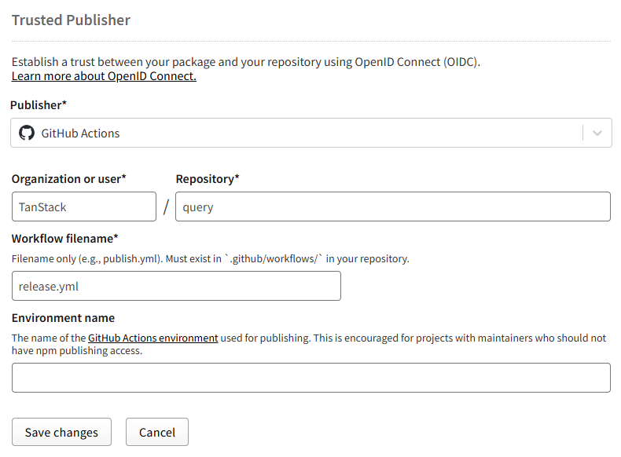

# Publishing and CI/CD

Publishing and continuous delivery.

<a id="source-config-docs-ci-cd-md"></a>

## Ci Cd

Source: `config:docs/ci-cd.md`.

### GitHub Workflows

- `pr.yml`:
  - Runs tests for all pull requests
  - Runs `nx affected`, which only executes tasks with invalidated cache
  - Also uses `pkg-pr-new` to publish package previews and create links to our examples
- `release.yml`:
  - Runs tests for code merged into release branches
  - Runs `nx run-many`, which executes all tasks and ensures the outputs are present (necessary for publishing builds)
  - Uses [Changesets](https://github.com/changesets/changesets) to handle versioning and publishing

### Nx

The TanStack projects use Nx to enable rapid execution of our tests and builds. Tasks are parallelised and cached both locally and in CI. While Nx has an extensive plugin system, we only utilise Nx as an NPM script runner.

#### Config Files

- `./nx.json`: Main config file, which defines task dependencies, inputs, and outputs
- `./package.json`: Need to manually specify root-level scripts (e.g. `test:eslint`)
- `./**/package.json`: Package-level scripts (e.g. `build`) are automatically detected

#### Nx Agents

- Nx allows you to distribute your tasks across multiple CI machines, increasing the number of jobs that can be run in parallel
- Please note that this does incur quite a significant startup delay

<a id="source-config-docs-publish-md"></a>

## Publish

Source: `config:docs/publish.md`.

### Installation

To install the package, run the following command:

```bash
pnpm add -D @tanstack/publish-config
```

### Usage

To use the TanStack Config programmatically, you can import the `publish` function:

```ts
import { publish } from '@tanstack/publish-config'

publish({
  branchConfigs: configOpts.branchConfigs,
  packages: configOpts.packages,
  rootDir: configOpts.rootDir,
  branch: process.env.BRANCH,
  tag: process.env.TAG,
  ghToken: process.env.GH_TOKEN,
})
  .then(() => {
    console.log('Successfully published packages!')
  })
  .catch(console.error)
```

> The programmatic usage is only available for ESM packages. To support this, you have to have:
>
> ```json
> {
>   "type": "module"
> }
> ```
>
> in your `package.json` file and use `import` instead of `require`.

### Trusted Publishing

Trusted publishing is the new npm strategy to allow publishing packages without npm tokens, using OIDC authentication. It currently requires you to set up for each package individually; however, once enabled, no further interaction is required!

#### Step 1

- If the package already has a published version on npm, you can skip this step.
- If the package has never been published, you can publish a "placeholder" package to do the setup process. This CLI tool streamlines this: [setup-npm-trusted-publish](https://github.com/azu/setup-npm-trusted-publish)

#### Step 2

- If you're only setting up one package, you can skip this step. Otherwise, the tools below help dramatically when setting up 5+ packages all at once.
- [open-packages-on-npm](https://github.com/antfu/open-packages-on-npm)
- [sxzz's userscript](https://github.com/sxzz/userscripts/blob/f54258a122c0fe5c09b6b8826800c00ac9b46e6e/src/npm-trusted-publisher.md)

#### Step 3

- Fill in the fields on the package's settings page, similar to this. You will need to authenticate with MFA to save these settings.


