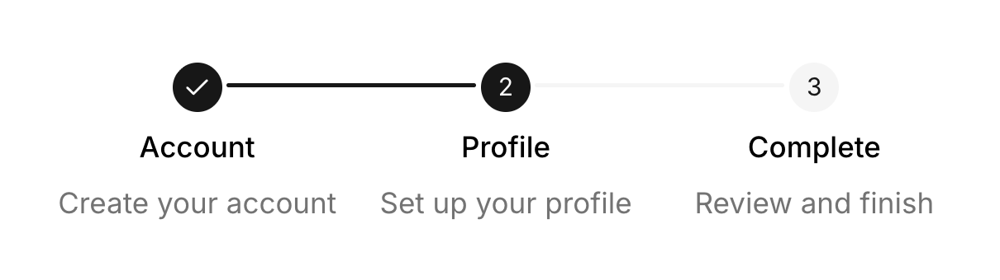

# Preact advanced patterns

Advanced Preact composition, validation, debugging, focus, and UI integration.

<a id="source-form-docs-framework-preact-guides-custom-errors-md"></a>

## Custom Errors

Source: `form:docs/framework/preact/guides/custom-errors.md`.

TanStack Form provides complete flexibility in the types of error values you can return from validators. String errors are the most common and easy to work with, but the library allows you to return any type of value from your validators.

As a general rule, any truthy value is considered an error and will mark the form or field as invalid, while falsy values (`false`, `undefined`, `null`, etc.) mean there is no error, and the form or field is valid.

### Return String Values from Forms

```tsx
<form.Field
  name="username"
  validators={{
    onChange: ({ value }) =>
      value.length < 3 ? 'Username must be at least 3 characters' : undefined,
  }}
/>
```

For form-level validation affecting multiple fields:

```tsx
const form = useForm({
  defaultValues: {
    username: '',
    email: '',
  },
  validators: {
    onChange: ({ value }) => {
      return {
        fields: {
          username:
            value.username.length < 3 ? 'Username too short' : undefined,
          email: !value.email.includes('@') ? 'Invalid email' : undefined,
        },
      }
    },
  },
})
```

String errors are the most common type and are easily displayed in your UI:

```tsx
{
  field.state.meta.errors.map((error, i) => (
    <div key={i} className="error">
      {error}
    </div>
  ))
}
```

#### Numbers

Useful for representing quantities, thresholds, or magnitudes:

```tsx
<form.Field
  name="age"
  validators={{
    onChange: ({ value }) => (value < 18 ? 18 - value : undefined),
  }}
/>
```

Display in UI:

```tsx
// TypeScript knows the error is a number based on your validator
<div className="error">
  You need {field.state.meta.errors[0]} more years to be eligible
</div>
```

#### Booleans

Simple flags to indicate error state:

```tsx
<form.Field
  name="accepted"
  validators={{
    onChange: ({ value }) => (!value ? true : undefined),
  }}
/>
```

Display in UI:

```tsx
{
  field.state.meta.errors[0] === true && (
    <div className="error">You must accept the terms</div>
  )
}
```

#### Objects

Rich error objects with multiple properties:

```tsx
<form.Field
  name="email"
  validators={{
    onChange: ({ value }) => {
      if (!value.includes('@')) {
        return {
          message: 'Invalid email format',
          severity: 'error',
          code: 1001,
        }
      }
      return undefined
    },
  }}
/>
```

Display in UI:

```tsx
{
  typeof field.state.meta.errors[0] === 'object' && (
    <div className={`error ${field.state.meta.errors[0].severity}`}>
      {field.state.meta.errors[0].message}
      <small> (Code: {field.state.meta.errors[0].code})</small>
    </div>
  )
}
```

In the example above, the rendered message, code and styling depend on the event error you want to display.

#### Arrays

Multiple error messages for a single field:

```tsx
<form.Field
  name="password"
  validators={{
    onChange: ({ value }) => {
      const errors = []
      if (value.length < 8) errors.push('Password too short')
      if (!/[A-Z]/.test(value)) errors.push('Missing uppercase letter')
      if (!/[0-9]/.test(value)) errors.push('Missing number')

      return errors.length ? errors : undefined
    },
  }}
/>
```

Display in UI:

```tsx
{
  Array.isArray(field.state.meta.errors) && (
    <ul className="error-list">
      {field.state.meta.errors.map((err, i) => (
        <li key={i}>{err}</li>
      ))}
    </ul>
  )
}
```

### The `disableErrorFlat` Prop on Fields

By default, TanStack Form flattens errors from all validation sources (`onChange`, `onBlur`, `onSubmit`) into a single `errors` array. The `disableErrorFlat` prop preserves the error sources:

```tsx
<form.Field
  name="email"
  disableErrorFlat
  validators={{
    onChange: ({ value }) =>
      !value.includes('@') ? 'Invalid email format' : undefined,
    onBlur: ({ value }) =>
      !value.endsWith('.com') ? 'Only .com domains allowed' : undefined,
    onSubmit: ({ value }) => (value.length < 5 ? 'Email too short' : undefined),
  }}
/>
```

Without `disableErrorFlat`, all errors would be combined into `field.state.meta.errors`. With it, you can access errors by their source:

```tsx
{
  field.state.meta.errorMap.onChange && (
    <div className="real-time-error">{field.state.meta.errorMap.onChange}</div>
  )
}

{
  field.state.meta.errorMap.onBlur && (
    <div className="blur-feedback">{field.state.meta.errorMap.onBlur}</div>
  )
}

{
  field.state.meta.errorMap.onSubmit && (
    <div className="submit-error">{field.state.meta.errorMap.onSubmit}</div>
  )
}
```

This is useful for:

- Displaying different types of errors with different UI treatments
- Prioritizing errors (e.g., showing submission errors more prominently)
- Implementing progressive disclosure of errors

### Type Safety of `errors` and `errorMap`

TanStack Form provides strong type safety for error handling. Each key in the `errorMap` has exactly the type returned by its corresponding validator, while the `errors` array contains a union type of all the possible error values from all validators:

```tsx
<form.Field
  name="password"
  validators={{
    onChange: ({ value }) => {
      // This returns a string or undefined
      return value.length < 8 ? 'Too short' : undefined
    },
    onBlur: ({ value }) => {
      // This returns an object or undefined
      if (!/[A-Z]/.test(value)) {
        return { message: 'Missing uppercase', level: 'warning' }
      }
      return undefined
    },
  }}
  children={(field) => {
    // TypeScript knows that errors[0] can be string | { message: string, level: string } | undefined
    const error = field.state.meta.errors[0]

    // Type-safe error handling
    if (typeof error === 'string') {
      return <div className="string-error">{error}</div>
    } else if (error && typeof error === 'object') {
      return <div className={error.level}>{error.message}</div>
    }

    return null
  }}
/>
```

The `errorMap` property is also fully typed, matching the return types of your validation functions:

```tsx
// With disableErrorFlat
<form.Field
  name="email"
  disableErrorFlat
  validators={{
    onChange: ({ value }): string | undefined =>
      !value.includes("@") ? "Invalid email" : undefined,
    onBlur: ({ value }): { code: number, message: string } | undefined =>
      !value.endsWith(".com") ? { code: 100, message: "Wrong domain" } : undefined
  }}
  children={(field) => {
    // TypeScript knows the exact type of each error source
    const onChangeError: string | undefined = field.state.meta.errorMap.onChange;
    const onBlurError: { code: number, message: string } | undefined = field.state.meta.errorMap.onBlur;

    return (/* ... */);
  }}
/>
```

This type safety helps catch errors at compile time instead of runtime, making your code more reliable and maintainable.

<a id="source-form-docs-framework-preact-guides-debugging-md"></a>

## Debugging

Source: `form:docs/framework/preact/guides/debugging.md`.

Here's a list of common errors you might see in the console and how to fix them.

### Changing an uncontrolled input to be controlled

If you see this error in the console:

```
Warning: A component is changing an uncontrolled input to be controlled. This is likely caused by the value changing from undefined to a defined value, which should not happen. Decide between using a controlled or uncontrolled input element for the lifetime of the component. More info: https://reactjs.org/link/controlled-components
```

It's likely you forgot the `defaultValues` in your `useForm` Hook or `form.Field` component usage. This is occurring
because the input is being rendered before the form value is initialized and is therefore changing from `undefined` to `""` when a text input is made.

### Field value is of type `unknown`

If you're using `form.Field` and, upon inspecting the value of `field.state.value`, you see that the value of a field is of type `unknown`, it's likely that your form's type was too large for us to safely evaluate.

This typically is a sign that you should break down your form into smaller forms or use a more specific type for your form.

A workaround to this problem is to cast `field.state.value` using TypeScript's `as` keyword:

```tsx
const value = field.state.value as string
```

### `Type instantiation is excessively deep and possibly infinite`

If you see this error in the console when running `tsc`:

```
Type instantiation is excessively deep and possibly infinite
```

You've run into a bug that we didn't catch in our type definitions. While we've done our best to make sure our types are as accurate as possible, there are some edge cases where TypeScript struggled with the complexity of our types.

Please [report this issue to us on GitHub](https://github.com/TanStack/form/issues) so we can fix it. Just make sure to include a minimal reproduction so that we're able to help you debug.

> Keep in mind that this error is a TypeScript error and not a runtime error. This means that your code will still run on the user's machine as expected.

<a id="source-form-docs-framework-preact-guides-dynamic-validation-md"></a>

## Dynamic Validation

Source: `form:docs/framework/preact/guides/dynamic-validation.md`.

In many cases, you want to change the validation rules depending on the state of the form or other conditions. The most popular
example of this is when you want to validate a field differently based on whether the user has submitted the form for the first time or not.

We support this through our `onDynamic` validation function.

```tsx
import { revalidateLogic, useForm } from '@tanstack/preact-form'

// ...

const form = useForm({
  defaultValues: {
    firstName: '',
    lastName: '',
  },
  // If this is omitted, `onDynamic` will not be called
  validationLogic: revalidateLogic(),
  validators: {
    onDynamic: ({ value }) => {
      if (!value.firstName) {
        return { firstName: 'A first name is required' }
      }
      return undefined
    },
  },
})
```

> [!IMPORTANT]
> By default, `onDynamic` is not called; therefore you must pass `revalidateLogic()` to the `validationLogic` option of `useForm`.

### Revalidation Options

`revalidateLogic` allows you to specify when validation should be run and to change the validation rules dynamically based on the current submission state of the form.

It takes two arguments:

- `mode`: The mode of validation prior to the first form submission. This can be one of the following:
  - `change`: Validate on every change.
  - `blur`: Validate on blur.
  - `submit`: Validate on submit. (**default**)

- `modeAfterSubmission`: The mode of validation after the form has been submitted. This can be one of the following:
  - `change`: Validate on every change. (**default**)
  - `blur`: Validate on blur.
  - `submit`: Validate on submit.

You can, for example, use the following to revalidate on blur after the first submission:

```tsx
const form = useForm({
  // ...
  validationLogic: revalidateLogic({
    mode: 'submit',
    modeAfterSubmission: 'blur',
  }),
  // ...
})
```

### Accessing Errors

Just as you might access errors from an `onChange` or `onBlur` validation, you can access errors from the `onDynamic` validation function using the `form.state.errorMap` object.

```tsx
function App() {
  const form = useForm({
    // ...
    validationLogic: revalidateLogic(),
    validators: {
      onDynamic: ({ value }) => {
        if (!value.firstName) {
          return { firstName: 'A first name is required' }
        }
        return undefined
      },
    },
  })

  return <p>{form.state.errorMap.onDynamic?.firstName}</p>
}
```

### Usage with Other Validation Logic

You can use `onDynamic` validation alongside other validation logic, such as `onChange` or `onBlur`.

```tsx
import { revalidateLogic, useForm } from '@tanstack/preact-form'

function App() {
  const form = useForm({
    defaultValues: {
      firstName: '',
      lastName: '',
    },
    validationLogic: revalidateLogic(),
    validators: {
      onChange: ({ value }) => {
        if (!value.firstName) {
          return { firstName: 'A first name is required' }
        }
        return undefined
      },
      onDynamic: ({ value }) => {
        if (!value.lastName) {
          return { lastName: 'A last name is required' }
        }
        return undefined
      },
    },
  })

  return (
    <div>
      <p>{form.state.errorMap.onChange?.firstName}</p>
      <p>{form.state.errorMap.onDynamic?.lastName}</p>
    </div>
  )
}
```

#### Usage with Fields

You can also use `onDynamic` validation with fields, just like you would with other validation logic.

```tsx
function App() {
  const form = useForm({
    defaultValues: {
      name: '',
      age: 0,
    },
    validationLogic: revalidateLogic(),
    onSubmit({ value }) {
      alert(JSON.stringify(value))
    },
  })

  return (
    <form
      onSubmit={(e) => {
        e.preventDefault()
        e.stopPropagation()
        form.handleSubmit()
      }}
    >
      <form.Field
        name={'age'}
        validators={{
          onDynamic: ({ value }) =>
            value > 18 ? undefined : 'Age must be greater than 18',
        }}
        children={(field) => (
          <div>
            <input
              type="number"
              onInput={(e) => field.handleChange(e.target.valueAsNumber)}
              onBlur={field.handleBlur}
              value={field.state.value}
            />
            <p style={{ color: 'red' }}>
              {field.state.meta.errorMap.onDynamic}
            </p>
          </div>
        )}
      />
      <button type="submit">Submit</button>
    </form>
  )
}
```

#### Async Validation

Async validation can also be used with `onDynamicAsync` just like with other validation logic. You can even debounce the async validation to avoid excessive calls.

```tsx
const form = useForm({
  defaultValues: {
    username: '',
  },
  validationLogic: revalidateLogic(),
  validators: {
    onDynamicAsyncDebounceMs: 500, // Debounce the async validation by 500ms
    onDynamicAsync: async ({ value }) => {
      if (!value.username) {
        return { username: 'Username is required' }
      }
      // Simulate an async validation
      const isValid = await validateUsername(value.username)
      return isValid ? undefined : { username: 'Username is already taken' }
    },
  },
})
```

#### Standard Schema Validation

You can also use standard schema validation libraries like Valibot or Zod with `onDynamic` validation. This allows you to define complex validation rules that can change dynamically based on the form state.

```tsx
import { z } from 'zod'

const schema = z.object({
  firstName: z.string().min(1, 'A first name is required'),
  lastName: z.string().min(1, 'A last name is required'),
})

const form = useForm({
  defaultValues: {
    firstName: '',
    lastName: '',
  },
  validationLogic: revalidateLogic(),
  validators: {
    onDynamic: schema,
  },
})
```

<a id="source-form-docs-framework-preact-guides-focus-management-md"></a>

## Focus Management

Source: `form:docs/framework/preact/guides/focus-management.md`.

In some instances, you may want to focus the first input with an error.

[Because TanStack Form intentionally does not have insights into your markup](./foundations.md#source-form-docs-philosophy-md), we cannot add a built-in focus management feature.

However, you can easily add this feature into your application without this hypothetical built-in feature.

### DOM

```tsx
import { useForm } from '@tanstack/preact-form'
import { z } from 'zod'

export default function App() {
  const form = useForm({
    defaultValues: { age: 0 },
    validators: {
      onChange: z.object({
        age: z.number().min(12),
      }),
    },
    onSubmit() {
      alert('Submitted!')
    },
    onSubmitInvalid() {
      const InvalidInput = document.querySelector(
        '[aria-invalid="true"]',
      ) as HTMLInputElement

      InvalidInput?.focus()
    },
  })

  return (
    <form
      onSubmit={(e) => {
        e.preventDefault()
        e.stopPropagation()
        void form.handleSubmit()
      }}
    >
      <form.Field
        name="age"
        children={(field) => (
          <label>
            Age
            <input
              name={field.name}
              value={field.state.value}
              aria-invalid={
                !field.state.meta.isValid && field.state.meta.isTouched
              }
              onInput={(e) => field.handleChange(e.target.valueAsNumber)}
              type="number"
            />
          </label>
        )}
      />
      <div>
        <button type="submit">Submit</button>
      </div>
    </form>
  )
}
```

### React Native (via compat)

Because React Native doesn't have access to the DOM's `querySelectorAll` API, we need to manually manage the element list
of the inputs. This allows us to focus the first input with an error:

```tsx
import { useRef } from 'preact/hooks'
import { Text, View, TextInput, Button, Alert } from 'react-native'
import { useForm } from '@tanstack/preact-form'
import { z } from 'zod'

export default function App() {
  // This can be extracted to a hook that returns the `fields` ref, a `focusFirstField` function, and a `addField` function
  const fields = useRef([] as Array<{ input: TextInput; name: string }>)

  const form = useForm({
    defaultValues: { age: 0 },
    validators: {
      onChange: z.object({
        age: z.number().min(12),
      }),
    },
    onSubmit() {
      Alert.alert('Submitted!')
    },
    onSubmitInvalid({ formApi }) {
      const errorMap = formApi.state.errorMap.onChange
      const inputs = fields.current

      let firstInput
      for (const input of inputs) {
        if (!input || !input.input) continue
        if (!!errorMap[input.name]) {
          firstInput = input.input
          break
        }
      }
      firstInput?.focus()
    },
  })

  return (
    <View style={{ padding: 16 }}>
      <form.Field
        name="age"
        children={(field) => (
          <View style={{ marginVertical: 16 }}>
            <Text>Age</Text>
            <TextInput
              keyboardType="numeric"
              ref={(input) => {
                // fields.current needs to be manually incremented so that we know what fields are rendered or not and in what order
                fields.current[0] = { input, name: field.name }
              }}
              style={{
                borderWidth: 1,
                borderColor: '#999999',
                borderRadius: 4,
                marginTop: 8,
                padding: 8,
              }}
              onChangeText={(val) => field.handleChange(Number(val))}
              value={field.state.value}
            />
          </View>
        )}
      />
      <Button title="Submit" onPress={form.handleSubmit} />
    </View>
  )
}
```

<a id="source-form-docs-framework-preact-guides-form-composition-md"></a>

## Form Composition

Source: `form:docs/framework/preact/guides/form-composition.md`.

A common criticism of TanStack Form is that it is verbose out-of-the-box. While this verbosity _can_ be useful for educational purposes - helping to enforce understanding of our APIs - it's not ideal in production use cases.

As a result, while `form.Field` enables the most powerful and flexible usage of TanStack Form, we provide APIs that wrap it and make your application code less verbose.

### Custom Form Hooks

The most powerful way to compose forms is to create custom form hooks. This allows you to create a form hook that is tailored to your application's needs, including pre-bound custom UI components and more.

At it's most basic, `createFormHook` is a function that takes a `fieldContext` and `formContext` and returns a `useAppForm` hook.

> This un-customized `useAppForm` hook is identical to `useForm`, but that will quickly change as we add more options to `createFormHook`.

```tsx
import { createFormHookContexts, createFormHook } from '@tanstack/preact-form'

// export useFieldContext for use in your custom components
export const { fieldContext, formContext, useFieldContext } =
  createFormHookContexts()

const { useAppForm } = createFormHook({
  fieldContext,
  formContext,
  // We'll learn more about these options later
  fieldComponents: {},
  formComponents: {},
})

function App() {
  const form = useAppForm({
    // Supports all useForm options
    defaultValues: {
      firstName: 'John',
      lastName: 'Doe',
    },
  })

  return <form.Field /> // ...
}
```

#### Pre-bound Field Components

Once this scaffolding is in place, you can start adding custom field and form components to your form hook.

> Note: the `useFieldContext` must be the same one exported from your custom form context

```tsx
import { useFieldContext } from './form-context.tsx'

export function TextField({ label }: { label: string }) {
  // The `Field` infers that it should have a `value` type of `string`
  const field = useFieldContext<string>()
  return (
    <label>
      <span>{label}</span>
      <input
        value={field.state.value}
        onInput={(e) => field.handleChange(e.target.value)}
      />
    </label>
  )
}
```

You're then able to register this component with your form hook.

```tsx
import { TextField } from './text-field.tsx'

const { useAppForm } = createFormHook({
  fieldContext,
  formContext,
  fieldComponents: {
    TextField,
  },
  formComponents: {},
})
```

And use it in your form:

```tsx
function App() {
  const form = useAppForm({
    defaultValues: {
      firstName: 'John',
      lastName: 'Doe',
    },
  })

  return (
    // Notice the `AppField` instead of `Field`; `AppField` provides the required context
    <form.AppField
      name="firstName"
      children={(field) => <field.TextField label="First Name" />}
    />
  )
}
```

This not only allows you to reuse the UI of your shared component, but retains the type-safety you'd expect from TanStack Form: Mistyping `name` will result in a TypeScript error.

##### A note on performance

While context is a valuable tool in the React ecosystem, there's appropriate concern from many users that providing a reactive value through a context will cause unnecessary re-renders.

> Unfamiliar with this performance concern? [Mark Erikson's blog post explaining why Redux solves many of these problems](https://blog.isquaredsoftware.com/2021/01/context-redux-differences/) is a great place to start.

While this is a good concern to call out, it's not a problem for TanStack Form; the values provided through context are not reactive themselves, but instead are static class instances with reactive properties ([using TanStack Store as our signals implementation to power the show](https://tanstack.com/store)).

#### Pre-bound Form Components

While `form.AppField` solves many of the problems with Field boilerplate and reusability, it doesn't solve the problem of _form_ boilerplate and reusability.

In particular, being able to share instances of `form.Subscribe` for, say, a reactive form submission button is a common usecase.

```tsx
function SubscribeButton({ label }: { label: string }) {
  const form = useFormContext()
  return (
    <form.Subscribe selector={(state) => state.isSubmitting}>
      {(isSubmitting) => (
        <button type="submit" disabled={isSubmitting}>
          {label}
        </button>
      )}
    </form.Subscribe>
  )
}

const { useAppForm, withForm } = createFormHook({
  fieldComponents: {},
  formComponents: {
    SubscribeButton,
  },
  fieldContext,
  formContext,
})

function App() {
  const form = useAppForm({
    defaultValues: {
      firstName: 'John',
      lastName: 'Doe',
    },
  })

  return (
    <form.AppForm>
      // Notice the `AppForm` component wrapper; `AppForm` provides the required
      context
      <form.SubscribeButton label="Submit" />
    </form.AppForm>
  )
}
```

### Breaking big forms into smaller pieces

Sometimes forms get very large; it's just how it goes sometimes. While TanStack Form supports large forms well, it's never fun to work with hundreds or thousands of lines of code in single files.

To solve this, we support breaking forms into smaller pieces using the `withForm` higher-order component.

```tsx
const { useAppForm, withForm } = createFormHook({
  fieldComponents: {
    TextField,
  },
  formComponents: {
    SubscribeButton,
  },
  fieldContext,
  formContext,
})

const ChildForm = withForm({
  // These values are only used for type-checking, and are not used at runtime
  // This allows you to `...formOpts` from `formOptions` without needing to redeclare the options
  defaultValues: {
    firstName: 'John',
    lastName: 'Doe',
  },
  // Optional, but adds props to the `render` function in addition to `form`
  props: {
    // These props are also set as default values for the `render` function
    title: 'Child Form',
  },
  render: function Render({ form, title }) {
    return (
      <div>
        <p>{title}</p>
        <form.AppField
          name="firstName"
          children={(field) => <field.TextField label="First Name" />}
        />
        <form.AppForm>
          <form.SubscribeButton label="Submit" />
        </form.AppForm>
      </div>
    )
  },
})

function App() {
  const form = useAppForm({
    defaultValues: {
      firstName: 'John',
      lastName: 'Doe',
    },
  })

  return <ChildForm form={form} title={'Testing'} />
}
```

#### `withForm` FAQ

> Why a higher-order component instead of a hook?

While hooks are the future of React, higher-order components are still a powerful tool for composition. In particular, the API of `withForm` enables us to have strong type-safety without requiring users to pass generics.

> Why am I getting ESLint errors about hooks in `render`?

ESLint looks for hooks in the top-level of a function, and `render` may not be recogized as a top-level component, depending on how you defined it.

```tsx
// This will cause ESLint errors with hooks usage
const ChildForm = withForm({
  // ...
  render: ({ form, title }) => {
    // ...
  },
})
```

```tsx
// This works fine
const ChildForm = withForm({
  // ...
  render: function Render({ form, title }) {
    // ...
  },
})
```

#### Context as a last resort

There are cases where passing `form` with `withForm` is not feasible. You may encounter it with components that don't
allow you to change their props.

For example, consider the following TanStack Router usage:

```ts
function RouteComponent() {
  const form = useAppForm({...formOptions, /* ... */ })
  // <Outlet /> cannot be customized or receive additional props
  return <Outlet />
}
```

In edge cases like this, a context-based fallback is available to access the form instance.

```ts
const { useAppForm, useTypedAppFormContext } = createFormHook({
  fieldContext,
  formContext,
  fieldComponents: {},
  formComponents: {},
})
```

> [!IMPORTANT] Type safety
> This mechanism exists solely to bridge integration constraints and should be avoided whenever `withForm` is possible.
> Context will not warn you when the types do not align. You risk runtime errors with this implementation.

Usage:

```tsx
// sharedOpts.ts
const formOpts = formOptions({
  /* ... */
})

function ParentComponent() {
  const form = useAppForm({ ...formOptions /* ... */ })

  return (
    <form.AppForm>
      <ChildComponent />
    </form.AppForm>
  )
}

function ChildComponent() {
  const form = useTypedAppFormContext({ ...formOptions })

  // You now have access to form components, field components and fields
}
```

### Reusing groups of fields in multiple forms

Sometimes, a pair of fields are so closely related that it makes sense to group and reuse them — like the password example listed in the [linked fields guide](./framework-preact.md#source-form-docs-framework-preact-guides-linked-fields-md). Instead of repeating this logic across multiple forms, you can utilize the `withFieldGroup` higher-order component.

> Unlike `withForm`, validators cannot be specified and could be any value.
> Ensure that your fields can accept unknown error types.

Rewriting the passwords example using `withFieldGroup` would look like this:

```tsx
const { useAppForm, withForm, withFieldGroup } = createFormHook({
  fieldComponents: {
    TextField,
    ErrorInfo,
  },
  formComponents: {
    SubscribeButton,
  },
  fieldContext,
  formContext,
})

type PasswordFields = {
  password: string
  confirm_password: string
}

// These default values are not used at runtime, but the keys are needed for mapping purposes.
// This allows you to spread `formOptions` without needing to redeclare it.
const defaultValues: PasswordFields = {
  password: '',
  confirm_password: '',
}

const FieldGroupPasswordFields = withFieldGroup({
  defaultValues,
  // You may also restrict the group to only use forms that implement this submit meta.
  // If none is provided, any form with the right defaultValues may use it.
  // onSubmitMeta: { action: '' }

  // Optional, but adds props to the `render` function in addition to `form`
  props: {
    // These props are set as default values for the `render` function
    title: 'Password',
  },
  // Internally, you will have access to a `group` instead of a `form`
  render: function Render({ group, title }) {
    // access reactive values using the group store
    const password = useSelector(group.store, (state) => state.values.password)
    // or the form itself
    const isSubmitting = useSelector(
      group.form.store,
      (state) => state.isSubmitting,
    )

    return (
      <div>
        <h2>{title}</h2>
        {/* Groups also have access to Field, Subscribe, Field, AppField and AppForm */}
        <group.AppField name="password">
          {(field) => <field.TextField label="Password" />}
        </group.AppField>
        <group.AppField
          name="confirm_password"
          validators={{
            onChangeListenTo: ['password'],
            onChange: ({ value, fieldApi }) => {
              // The form could be any values, so it is typed as 'unknown'
              const values: unknown = fieldApi.form.state.values
              // use the group methods instead
              if (value !== group.getFieldValue('password')) {
                return 'Passwords do not match'
              }
              return undefined
            },
          }}
        >
          {(field) => (
            <div>
              <field.TextField label="Confirm Password" />
              <field.ErrorInfo />
            </div>
          )}
        </group.AppField>
      </div>
    )
  },
})
```

We can now use these grouped fields in any form that implements the default values:

```tsx
// You are allowed to extend the group fields as long as the
// existing properties remain unchanged
type Account = PasswordFields & {
  provider: string
  username: string
}

// You may nest the group fields wherever you want
type FormValues = {
  name: string
  age: number
  account_data: PasswordFields
  linked_accounts: Account[]
}

const defaultValues: FormValues = {
  name: '',
  age: 0,
  account_data: {
    password: '',
    confirm_password: '',
  },
  linked_accounts: [
    {
      provider: 'TanStack',
      username: '',
      password: '',
      confirm_password: '',
    },
  ],
}

function App() {
  const form = useAppForm({
    defaultValues,
    // If the group didn't specify an `onSubmitMeta` property,
    // the form may implement any meta it wants.
    // Otherwise, the meta must be defined and match.
    onSubmitMeta: { action: '' },
  })

  return (
    <form.AppForm>
      <FieldGroupPasswordFields
        form={form}
        // You must specify where the fields can be found
        fields="account_data"
        title="Passwords"
      />
      <form.Field name="linked_accounts" mode="array">
        {(field) =>
          field.state.value.map((account, i) => (
            <FieldGroupPasswordFields
              key={account.provider}
              form={form}
              // The fields may be in nested fields
              fields={`linked_accounts[${i}]`}
              title={account.provider}
            />
          ))
        }
      </form.Field>
    </form.AppForm>
  )
}
```

#### Mapping field group values to a different field

You may want to keep the password fields on the top level of your form, or rename the properties for clarity. You can map field group values
to their true location by changing the `field` property:

> [!IMPORTANT]
> Due to TypeScript limitations, field mapping is only allowed for objects. You can use records or arrays at the top level of a field group, but you will not be able to map the fields.

```tsx
// To have an easier form, you can keep the fields on the top level
type FormValues = {
  name: string
  age: number
  password: string
  confirm_password: string
}

const defaultValues: FormValues = {
  name: '',
  age: 0,
  password: '',
  confirm_password: '',
}

function App() {
  const form = useAppForm({
    defaultValues,
  })

  return (
    <form.AppForm>
      <FieldGroupPasswordFields
        form={form}
        // You can map the fields to their equivalent deep key
        fields={{
          password: 'password',
          confirm_password: 'confirm_password',
          // or map them to differently named keys entirely
          // 'password': 'name'
        }}
        title="Passwords"
      />
    </form.AppForm>
  )
}
```

If you expect your fields to always be at the top level of your form, you can create a quick map
of your field groups using a helper function:

```tsx
const defaultValues: PasswordFields = {
  password: '',
  confirm_password: '',
}

const passwordFields = createFieldMap(defaultValues)
/* This generates the following map:
 {
    'password': 'password',
    'confirm_password': 'confirm_password'
 }
*/

// Usage:
<FieldGroupPasswordFields
  form={form}
  fields={passwordFields}
  title="Passwords"
/>
```

### Tree-shaking form and field components

While the above examples are great for getting started, they're not ideal for certain use-cases where you might have hundreds of form and field components.
In particular, you may not want to include all of your form and field components in the bundle of every file that uses your form hook.

To solve this, you can mix the `createFormHook` TanStack API with the React `lazy` and `Suspense` components:

```typescript
// src/hooks/form-context.ts
import { createFormHookContexts } from '@tanstack/preact-form'

export const { fieldContext, useFieldContext, formContext, useFormContext } =
  createFormHookContexts()
```

```tsx
// src/components/text-field.tsx
import { useFieldContext } from '../hooks/form-context.tsx'

export default function TextField({ label }: { label: string }) {
  const field = useFieldContext<string>()

  return (
    <label>
      <span>{label}</span>
      <input
        value={field.state.value}
        onInput={(e) => field.handleChange(e.target.value)}
      />
    </label>
  )
}
```

```tsx
// src/hooks/form.ts
import { lazy } from 'preact/compat'
import { createFormHook } from '@tanstack/preact-form'

const TextField = lazy(() => import('../components/text-fields.tsx'))

const { useAppForm, withForm } = createFormHook({
  fieldContext,
  formContext,
  fieldComponents: {
    TextField,
  },
  formComponents: {},
})
```

```tsx
// src/App.tsx
import { Suspense } from 'preact/compat'
import { PeoplePage } from './features/people/form.tsx'

export default function App() {
  return (
    <Suspense fallback={<p>Loading...</p>}>
      <PeoplePage />
    </Suspense>
  )
}
```

This will show the Suspense fallback while the `TextField` component is being loaded, and then render the form once it's loaded.

### Putting it all together

Now that we've covered the basics of creating custom form hooks, let's put it all together in a single example.

```tsx
// /src/hooks/form.ts, to be used across the entire app
const { fieldContext, useFieldContext, formContext, useFormContext } =
  createFormHookContexts()

function TextField({ label }: { label: string }) {
  const field = useFieldContext<string>()
  return (
    <label>
      <span>{label}</span>
      <input
        value={field.state.value}
        onInput={(e) => field.handleChange(e.target.value)}
      />
    </label>
  )
}

function SubscribeButton({ label }: { label: string }) {
  const form = useFormContext()
  return (
    <form.Subscribe selector={(state) => state.isSubmitting}>
      {(isSubmitting) => <button disabled={isSubmitting}>{label}</button>}
    </form.Subscribe>
  )
}

const { useAppForm, withForm } = createFormHook({
  fieldComponents: {
    TextField,
  },
  formComponents: {
    SubscribeButton,
  },
  fieldContext,
  formContext,
})

// /src/features/people/shared-form.ts, to be used across `people` features
const formOpts = formOptions({
  defaultValues: {
    firstName: 'John',
    lastName: 'Doe',
  },
})

// /src/features/people/nested-form.ts, to be used in the `people` page
const ChildForm = withForm({
  ...formOpts,
  // Optional, but adds props to the `render` function outside of `form`
  props: {
    title: 'Child Form',
  },
  render: ({ form, title }) => {
    return (
      <div>
        <p>{title}</p>
        <form.AppField
          name="firstName"
          children={(field) => <field.TextField label="First Name" />}
        />
        <form.AppForm>
          <form.SubscribeButton label="Submit" />
        </form.AppForm>
      </div>
    )
  },
})

// /src/features/people/page.ts
const Parent = () => {
  const form = useAppForm({
    ...formOpts,
  })

  return <ChildForm form={form} title={'Testing'} />
}
```

### API Usage Guidance

Here's a chart to help you decide what APIs you should be using:



<a id="source-form-docs-framework-preact-guides-form-groups-md"></a>

## Form Groups

Source: `form:docs/framework/preact/guides/form-groups.md`.

When building a multi-stage form that has many stages, like so:



It's common for each step to have its own form. However, this complicates the form submission and validation process by requiring you to add complex logic.

Luckily, TanStack Form provides a way to build out sub-forms that make this kind of development trivial to implement: `<form.FormGroup>`.

### Usage

To use a form group in TanStack Form, you'll use `useForm` or [`useAppForm`](./framework-preact-advanced.md#source-form-docs-framework-preact-guides-form-composition-md) to create a `form` variable, then reference its `FormGroup` component like you would a `Field`:

```tsx
const form = useForm({
    defaultValues: {
        step1: {
            name: ""
        },
        step2: {
            age: 0
        }
    }
})

return (
    <form.FormGroup
        name="step1"
        children={group => (
            // `group` here has all of the form-like methods you'd expect like `deleteField` or `insertFieldValue`
            // ...
        )}
    />
)
```

This becomes much more useful when paired with external state to conditionally render a `FormGroup`:

```tsx
const [step, setStep] = useState(0)
const form = useForm({
    defaultValues: {
        step1: {
            name: ""
        },
        step2: {
            age: 0
        }
    }
})

return (
    <>
        {step === 0 ? <form.FormGroup
            name="step1"
            onGroupSubmit={() => {
                // We can move the step forward when validation passes
                setStep(step + 1)
            }}
            onGroupSubmitInvalid={() => {
                // Or handle invalid submissions, just like a top-level form
            }}
            onSubmitMeta={{} as SomeType}
            children={group => (
                // Use `group.handleSubmit()` to submit the sub-form, but not the parent form
                // ...
            )}
        /> : null }
        {step === 1 ? <form.FormGroup
            name="step2"
            children={group => (
                // Then, use `form.handleSubmit()` to submit the entire form
                // ...
            )}
        /> : null }
    </>
)
```

### Form Group Validation

Form groups have a distinct validation proceedure that we think makes sense for sub-forms:

- Form groups can have their own validation:

```tsx
<form.FormGroup
  name="step1"
  validators={{ onChange: () => 'Error' }}
  children={(group) => {
    group.state.meta.errorMap // {onChange: "Error" | undefined}
    group.state.meta.errors // ("Error")[]
  }}
/>
```

- Can set errors on sub-fields:

```tsx
<form.FormGroup
  name="step1"
  validators={{
    onChange: ({ value, groupApi }) => ({
      group: value.name === 'error' ? 'Group error' : undefined,
      fields: {
        // Must use the name of the field relative to the FormGroup as the error key,
        // to stay consistent with how standard schema works with form groups
        name: value.name === 'error' ? 'Field error' : undefined,
      },
    }),
  }}
/>
```

- And can even accept standard schemas:

```tsx
<form.FormGroup
  name="step1"
  validators={{
    onChange: z.object({
      name: z.string().min(2),
    }),
  }}
/>
```

> The reason we don't use the full path names for fields is so that you can compose your schemas like so:
>
> ```
> const step1Schema = z.object({
>     name: z.string().min(2)
> })
>
> const schema = z.object({
>     step1: step1Schema,
>     step2: step2Schema
> })
> ```
>
> And pass the `step1Schema` to a form group and `schema` to the parent form. That way, partially validated data will still flag errors if the group is bypassed.

#### Dynamic Group Validation

If you want to use [dynamic validation (`onDynamic`)](./framework-preact-advanced.md#source-form-docs-framework-preact-guides-dynamic-validation-md) with a form group, do not rely on the `onDynamic` validator passed to `useForm`:

```tsx
useForm({
  validationLogic: revalidateLogic(),
  validators: {
    // This validator will not run `onChange` when a sub-form is submitted;
    // it will only run `onChange` when the form itself is submitted.
    onDynamic: schema,
  },
})
```

Instead, pass your sub-schema for the group to the `onDynamic` validation of the `FormGroup` itself:

```tsx
<form.FormGroup validators={{ onDynamic: step1Schema }} />
```

It will treat `group.submissionAttempts` as the way to change what validator is ran before/after submit.

### Form Group State

Just like you're able to access `group.state.meta.errors`, you're also able to access the group's value using `group.state.value`. Likewise, here are some valuable properties you can access in the `group.state.meta`:

- `group.state.meta.isFieldsValid`: `true` when the field-level validators have no errors
- `group.state.meta.isGroupValid`: `true` when the group-level validators have no errors
- `group.state.meta.isValid`: `true` when both the field-level and group-level validators have no errors
- `group.state.meta.isSubmitting`: `true` when the group is in the process of being submitted

<a id="source-form-docs-framework-preact-guides-ui-libraries-md"></a>

## Ui Libraries

Source: `form:docs/framework/preact/guides/ui-libraries.md`.

### Usage of TanStack Form with UI Libraries

TanStack Form is a headless library, offering you complete flexibility to style it as you see fit. It's compatible with a wide range of UI libraries, including `Chakra UI`, `Tailwind`, `Material UI`, `Mantine`, `shadcn/ui`, or even plain CSS.

This guide focuses on `Chakra UI`, `Material UI`, `Mantine`, and `shadcn/ui`, but the concepts are applicable to any UI library of your choice.

#### Prerequisites

Before integrating TanStack Form with a UI library, ensure the necessary dependencies are installed in your project:

- For `Chakra UI`, follow the installation instructions on their [official site](https://chakra-ui.com/docs/get-started/installation)
- For `Material UI`, follow the installation instructions on their [official site](https://mui.com/material-ui/getting-started/).
- For `Mantine`, refer to their [documentation](https://mantine.dev/).
- For `shadcn/ui`, refer to their [official site](https://ui.shadcn.com/).

Note: While you can mix and match libraries, it's generally advisable to stick with one to maintain consistency and minimize bloat.

#### Example with Mantine

Here's an example demonstrating the integration of TanStack Form with Mantine components:

```tsx
import { TextInput, Checkbox } from '@mantine/core'
import { useForm } from '@tanstack/preact-form'

export default function App() {
  const { Field, handleSubmit, state } = useForm({
    defaultValues: {
      name: '',
      isChecked: false,
    },
    onSubmit: async ({ value }) => {
      // Handle form submission
      console.log(value)
    },
  })

  return (
    <>
      <form
        onSubmit={(e) => {
          e.preventDefault()
          handleSubmit()
        }}
      >
        <Field
          name="name"
          children={({ state, handleChange, handleBlur }) => (
            <TextInput
              defaultValue={state.value}
              onInput={(e) => handleChange(e.target.value)}
              onBlur={handleBlur}
              placeholder="Enter your name"
            />
          )}
        />
        <Field
          name="isChecked"
          children={({ state, handleChange, handleBlur }) => (
            <Checkbox
              onInput={(e) => handleChange(e.target.checked)}
              onBlur={handleBlur}
              checked={state.value}
            />
          )}
        />
      </form>
      <div>
        <pre>{JSON.stringify(state.values, null, 2)}</pre>
      </div>
    </>
  )
}
```

- Initially, we utilize the `useForm` hook from TanStack and destructure the necessary properties. This step is optional; alternatively, you could use `const form = useForm()` if preferred. TypeScript's type inference ensures a smooth experience regardless of the approach.
- The `Field` component, derived from `useForm`, accepts several properties, such as `validators`. For this demonstration, we focus on two primary properties: `name` and `children`.
  - The `name` property identifies each `Field`, for instance, `name` in our example.
  - The `children` property leverages the concept of render props, allowing us to integrate components without unnecessary abstractions.
- TanStack's design relies heavily on render props, providing access to `children` within the `Field` component. This approach is entirely type-safe. When integrating with Mantine components, such as `TextInput`, we selectively destructure properties like `state.value`, `handleChange`, and `handleBlur`. This selective approach is due to the slight differences in types between `TextInput` and the `field` we get in the children.
- By following these steps, you can seamlessly integrate Mantine components with TanStack Form.
- This methodology is equally applicable to other components, such as `Checkbox`, ensuring consistent integration across different UI elements.

#### Usage with Material UI

The process for integrating Material UI components is similar. Here's an example using TextField and Checkbox from Material UI:

```tsx
<Field
  name="name"
  children={({ state, handleChange, handleBlur }) => {
    return (
      <TextField
        id="filled-basic"
        label="Filled"
        variant="filled"
        defaultValue={state.value}
        onInput={(e) => handleChange(e.target.value)}
        onBlur={handleBlur}
        placeholder="Enter your name"
      />
    );
  }}
/>

<Field
  name="isMuiCheckBox"
  children={({ state, handleChange, handleBlur }) => {
    return (
      <MuiCheckbox
        onInput={(e) => handleChange(e.target.checked)}
        onBlur={handleBlur}
        checked={state.value}
      />
    );
  }}
/>

```

- The integration approach is the same as with Mantine.
- The primary difference lies in the specific Material UI component properties and styling options.

#### Usage with shadcn/ui

The process for integrating shadcn/ui components is similar. Here's an example using Input and Checkbox from shadcn/ui:

```tsx
<Field
  name="name"
  children={({ state, handleChange, handleBlur }) => (
    <Input
      value={state.value}
      onInput={(e) => handleChange(e.target.value)}
      onBlur={handleBlur}
      placeholder="Enter your name"
    />
  )}
/>
<Field
  name="isChecked"
  children={({ state, handleChange, handleBlur }) => (
    <Checkbox
      onCheckedChange={(checked) => handleChange(checked === true)}
      onBlur={handleBlur}
      checked={state.value}
    />
  )}
/>
```

- The integration approach is the same as with Mantine, Material UI.
- The primary difference lies in the specific shadcn/ui component properties and styling options.
- Note the onCheckedChange property of Checkbox instead of onChange.

The ShadCN library includes a dedicated guide covering common scenarios for integrating TanStack Form with its components: [https://ui.shadcn.com/docs/forms/tanstack-form](https://ui.shadcn.com/docs/forms/tanstack-form)

#### Usage with Chakra UI

The process for integrating Chakra UI components is similar. Here's an example using Input and Checkbox from Chakra UI:

```tsx
<Field
  name="name"
  children={({ state, handleChange, handleBlur }) => (
    <Input
      value={state.value}
      onInput={(e) => handleChange(e.target.value)}
      onBlur={handleBlur}
      placeholder="Enter your name"
    />
  )}
/>
<Field
  name="isChecked"
  children={({ state, handleChange, handleBlur }) => (
    <Checkbox.Root
      checked={state.value}
      onCheckedChange={(details) => handleChange(!!details.checked)}
      onBlur={handleBlur}
    >
      <Checkbox.HiddenInput />
      <Checkbox.Control />
      <Checkbox.Label>Accept terms</Checkbox.Label>
    </Checkbox.Root>
  )}
/>
```

- The integration approach is the same as with Mantine, Material UI, and shadcn/ui.
- Chakra UI exposes its Checkbox as a composable component with separate `Checkbox.Root`, `Checkbox.Control`, `Checkbox.Label`, and `Checkbox.HiddenInput` parts that you wire together.
- The double negation `!!` is used on `onCheckedChange` to coerce Chakra's `"indeterminate"` state to a boolean, ensuring it matches the form state. See the [Chakra UI Checkbox documentation](https://chakra-ui.com/docs/components/checkbox#indeterminate) for more details.
- Alternatively, Chakra UI offers a pre-composed Checkbox component that works the same way as their standard examples, without requiring manual composition. You can learn more about this closed component approach in the [Chakra UI Checkbox documentation](https://chakra-ui.com/docs/components/checkbox#closed-component).
- The TanStack Form integration works identically with either approach—simply attach the `checked`, `onCheckedChange`, and `onBlur` handlers to your chosen component.

Example using the closed Checkbox component:

```tsx
<Field
  name="isChecked"
  children={({ state, handleChange, handleBlur }) => (
    <Checkbox
      checked={state.value}
      onCheckedChange={(details) => handleChange(!!details.checked)}
      onBlur={handleBlur}
    >
      Accept terms
    </Checkbox>
  )}
/>
```
