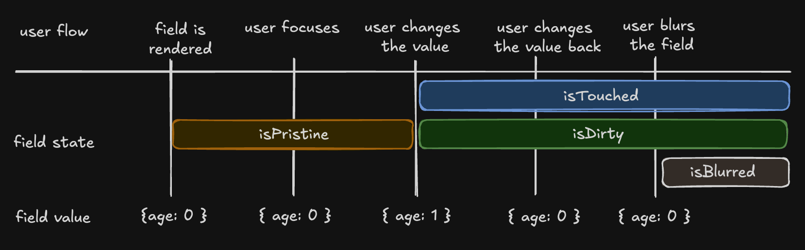
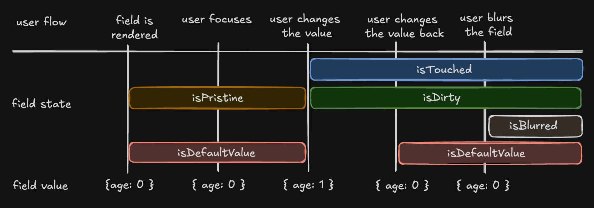

# Preact adapter

Preact quick start, fields, state, validation, submission, and reactivity.

<a id="source-form-docs-framework-preact-guides-arrays-md"></a>

## Arrays

Source: `form:docs/framework/preact/guides/arrays.md`.

TanStack Form supports arrays as values in a form, including sub-object values inside of an array.

### Basic Usage

To use an array, you can use `field.state.value` on an array value:

```jsx
function App() {
  const form = useForm({
    defaultValues: {
      people: [],
    },
  })

  return (
    <form.Field name="people" mode="array">
      {(field) => (
        <div>
          {field.state.value.map((_, i) => {
            // ...
          })}
        </div>
      )}
    </form.Field>
  )
}
```

This will generate the mapped JSX every time you run `pushValue` on `field`:

```jsx
<button onClick={() => field.pushValue({ name: '', age: 0 })} type="button">
  Add person
</button>
```

Finally, you can use a subfield like so:

```jsx
<form.Field key={i} name={`people[${i}].name`}>
  {(subField) => (
    <input
      value={subField.state.value}
      onInput={(e) => subField.handleChange(e.target.value)}
    />
  )}
</form.Field>
```

### Full Example

```jsx
function App() {
  const form = useForm({
    defaultValues: {
      people: [],
    },
    onSubmit({ value }) {
      alert(JSON.stringify(value))
    },
  })

  return (
    <div>
      <form
        onSubmit={(e) => {
          e.preventDefault()
          e.stopPropagation()
          form.handleSubmit()
        }}
      >
        <form.Field name="people" mode="array">
          {(field) => {
            return (
              <div>
                {field.state.value.map((_, i) => {
                  return (
                    <form.Field key={i} name={`people[${i}].name`}>
                      {(subField) => {
                        return (
                          <div>
                            <label>
                              <div>Name for person {i}</div>
                              <input
                                value={subField.state.value}
                                onInput={(e) =>
                                  subField.handleChange(e.target.value)
                                }
                              />
                            </label>
                          </div>
                        )
                      }}
                    </form.Field>
                  )
                })}
                <button
                  onClick={() => field.pushValue({ name: '', age: 0 })}
                  type="button"
                >
                  Add person
                </button>
              </div>
            )
          }}
        </form.Field>
        <form.Subscribe
          selector={(state) => [state.canSubmit, state.isSubmitting]}
          children={([canSubmit, isSubmitting]) => (
            <button type="submit" disabled={!canSubmit}>
              {isSubmitting ? '...' : 'Submit'}
            </button>
          )}
        />
      </form>
    </div>
  )
}
```

<a id="source-form-docs-framework-preact-guides-async-initial-values-md"></a>

## Async Initial Values

Source: `form:docs/framework/preact/guides/async-initial-values.md`.

Let's say that you want to fetch some data from an API and use it as the initial value of a form.

While this problem sounds simple on the surface, there are hidden complexities you might not have thought of thus far.

For example, you might want to show a loading spinner while the data is being fetched, or you might want to handle errors gracefully.
Likewise, you could also find yourself looking for a way to cache the data so that you don't have to fetch it every time the form is rendered.

While we could implement many of these features from scratch, it would end up looking a lot like another project we maintain: [TanStack Query](https://tanstack.com/query).

As such, this guide shows you how you can mix-n-match TanStack Form with TanStack Query to achieve the desired behavior.

### Basic Usage

```tsx
import { useForm } from '@tanstack/preact-form'
import { useQuery } from '@tanstack/react-query'

export default function App() {
  const {data, isLoading} = useQuery({
    queryKey: ['data'],
    queryFn: async () => {
      await new Promise((resolve) => setTimeout(resolve, 1000))
      return {firstName: 'FirstName', lastName: "LastName"}
    }
  })

  const form = useForm({
    defaultValues: {
      firstName: data?.firstName ?? '',
      lastName: data?.lastName ?? '',
    },
    onSubmit: async ({ value }) => {
      // Do something with form data
      console.log(value)
    },
  })

  if (isLoading) return <p>Loading...</p>

  return (
    // ...
  )
}
```

This will show a loading spinner until the data is fetched, and then it will render the form with the fetched data as the initial values.

<a id="source-form-docs-framework-preact-guides-basic-concepts-md"></a>

## Basic Concepts

Source: `form:docs/framework/preact/guides/basic-concepts.md`.

This page introduces the basic concepts and terminology used in the `@tanstack/preact-form` library. Familiarizing yourself with these concepts will help you better understand and work with the library.

### Form Options

You can customize your form by creating configuration options with the `formOptions` function. These options can be shared between multiple forms.

Example:

```tsx
interface User {
  firstName: string
  lastName: string
  hobbies: Array<string>
}
const defaultUser: User = { firstName: '', lastName: '', hobbies: [] }

const formOpts = formOptions({
  defaultValues: defaultUser,
})
```

### Form Instance

A Form instance is an object that represents an individual form and provides methods and properties for working with the form. You create a Form instance using the `useForm` hook provided by the form options. The hook accepts an object with an `onSubmit` function, which is called when the form is submitted.

```tsx
const form = useForm({
  ...formOpts,
  onSubmit: async ({ value }) => {
    // Do something with form data
    console.log(value)
  },
})
```

You may also create a Form instance without using `formOptions` by using the standalone `useForm` API:

```tsx
interface User {
  firstName: string
  lastName: string
  hobbies: Array<string>
}
const defaultUser: User = { firstName: '', lastName: '', hobbies: [] }

const form = useForm({
  defaultValues: defaultUser,
  onSubmit: async ({ value }) => {
    // Do something with form data
    console.log(value)
  },
})
```

### Field

A Field represents a single form input element, such as a text input or a checkbox. Fields are created using the `form.Field` component provided by the Form instance. The component accepts a `name` prop, which should match a key in the form's default values. It also accepts a `children` prop, which is a render prop function that takes a `field` object as its argument.

Example:

```tsx
<form.Field
  name="firstName"
  children={(field) => (
    <>
      <input
        value={field.state.value}
        onBlur={field.handleBlur}
        onInput={(e) => field.handleChange(e.target.value)}
      />
      <FieldInfo field={field} />
    </>
  )}
/>
```

If you run into issues handling `children` as props, make sure to check your linting rules.

Example (ESLint):

```json
  "rules": {
    "react/no-children-prop": [
      true,
      {
        "allowFunctions": true
      }
    ],
  }
```

### Field State

Each field has its own state, which includes its current value, validation status, error messages, and other metadata. You can access a field's state using the `field.state` property.

Example:

```ts
const {
  value,
  meta: { errors, isValidating },
} = field.state
```

There are four states in the metadata that can be useful for seeing how the user interacts with a field:

- **isTouched**: is `true` once the user changes or blurs the field
- **isDirty**: is `true` once the field's value is changed, even if it's reverted to the default. Opposite of `isPristine`
- **isPristine**: is `true` until the user changes the field's value. Opposite of `isDirty`
- **isBlurred**: is `true` once the field loses focus (is blurred)
- **isDefaultValue**: is `true` when the field's current value is the default value

```ts
const { isTouched, isDirty, isPristine, isBlurred } = field.state.meta
```



### Understanding 'isDirty' in Different Libraries

Non-Persistent `dirty` state

- **Libraries**: React Hook Form (RHF), Formik, Final Form.
- **Behavior**: A field is 'dirty' if its value differs from the default. Reverting to the default value makes it 'clean' again.

Persistent `dirty` state

- **Libraries**: Angular Form, Vue FormKit.
- **Behavior**: A field remains 'dirty' once changed, even if reverted to the default value.

We have chosen the persistent 'dirty' state model. However, we have introduced the `isDefaultValue` flag to also support a non-persistent 'dirty' state.

```ts
const { isDefaultValue, isTouched } = field.state.meta

// The following line will re-create the non-persistent `dirty` functionality.
const nonPersistentIsDirty = !isDefaultValue
```



### Field API

The Field API is an object passed to the render prop function when creating a field. It provides methods for working with the field's state.

Example:

```tsx
<input
  value={field.state.value}
  onBlur={field.handleBlur}
  onInput={(e) => field.handleChange(e.target.value)}
/>
```

### Validation

`@tanstack/preact-form` provides both synchronous and asynchronous validation out of the box. Validation functions can be passed to the `form.Field` component using the `validators` prop.

Example:

```tsx
<form.Field
  name="firstName"
  validators={{
    onChange: ({ value }) =>
      !value
        ? 'A first name is required'
        : value.length < 3
          ? 'First name must be at least 3 characters'
          : undefined,
    onChangeAsync: async ({ value }) => {
      await new Promise((resolve) => setTimeout(resolve, 1000))
      return value.includes('error') && 'No "error" allowed in first name'
    },
  }}
  children={(field) => (
    <>
      <input
        value={field.state.value}
        onBlur={field.handleBlur}
        onInput={(e) => field.handleChange(e.target.value)}
      />
      <FieldInfo field={field} />
    </>
  )}
/>
```

### Validation with Standard Schema Libraries

In addition to hand-rolled validation options, we also support the [Standard Schema](https://github.com/standard-schema/standard-schema) specification.

You can define a schema using any of the libraries implementing the specification and pass it to a form or field validator.

Supported libraries include:

- [Zod](https://zod.dev/) (v3.24.0 or higher)
- [Valibot](https://valibot.dev/) (v1.0.0 or higher)
- [ArkType](https://arktype.io/) (v2.1.20 or higher)
- [Yup](https://github.com/jquense/yup) (v1.7.0 or higher)

```tsx
import { z } from 'zod'

const userSchema = z.object({
  age: z.number().gte(13, 'You must be 13 to make an account'),
})

function App() {
  const form = useForm({
    defaultValues: {
      age: 0,
    },
    validators: {
      onChange: userSchema,
    },
  })
  return (
    <div>
      <form.Field
        name="age"
        children={(field) => {
          return <>{/* ... */}</>
        }}
      />
    </div>
  )
}
```

### Reactivity

`@tanstack/preact-form` offers various ways to subscribe to form and field state changes, most notably the `useSelector(form.store, …)` hook and the `form.Subscribe` component. These methods allow you to optimize your form's rendering performance by only updating components when necessary.

Example:

```tsx
import { useSelector } from '@tanstack/preact-form'

const firstName = useSelector(form.store, (state) => state.values.firstName)
//...
<form.Subscribe
  selector={(state) => [state.canSubmit, state.isSubmitting]}
  children={([canSubmit, isSubmitting]) => (
    <button type="submit" disabled={!canSubmit}>
      {isSubmitting ? '...' : 'Submit'}
    </button>
  )}
/>
```

It is important to remember that while the `useSelector` hook's `selector` prop is optional, it is strongly recommended to provide one, as omitting it will result in unnecessary re-renders.

```tsx
// Correct use
const firstName = useSelector(form.store, (state) => state.values.firstName)
const errors = useSelector(form.store, (state) => state.errorMap)
// Incorrect use
const store = useSelector(form.store)
```

Note: The usage of the `useField` hook to achieve reactivity is discouraged since it is designed to be used thoughtfully within the `form.Field` component. You might want to use `useSelector(form.store, …)` instead.

### Listeners

`@tanstack/preact-form` allows you to react to specific triggers and "listen" to them to dispatch side effects.

Example:

```tsx
<form.Field
  name="country"
  listeners={{
    onChange: ({ value }) => {
      console.log(`Country changed to: ${value}, resetting province`)
      form.setFieldValue('province', '')
    },
  }}
/>
```

More information can be found at [Listeners](./framework-preact.md#source-form-docs-framework-preact-guides-listeners-md)

### Array Fields

Array fields allow you to manage a list of values within a form, such as a list of hobbies. You can create an array field using the `form.Field` component with the `mode="array"` prop.

When working with array fields, you can use the `pushValue`, `removeValue`, `swapValues`, and `moveValue` methods to add, remove, swap, and move a value from one index to another within the array, respectively. Additional helper methods such as `insertValue`, `replaceValue`, and `clearValues` are also available for inserting, replacing, and clearing array values.

Example:

```tsx
<form.Field
  name="hobbies"
  mode="array"
  children={(hobbiesField) => (
    <div>
      Hobbies
      <div>
        {!hobbiesField.state.value.length
          ? 'No hobbies found.'
          : hobbiesField.state.value.map((_, i) => (
              <div key={i}>
                <form.Field
                  name={`hobbies[${i}].name`}
                  children={(field) => {
                    return (
                      <div>
                        <label htmlFor={field.name}>Name:</label>
                        <input
                          id={field.name}
                          name={field.name}
                          value={field.state.value}
                          onBlur={field.handleBlur}
                          onInput={(e) => field.handleChange(e.target.value)}
                        />
                        <button
                          type="button"
                          onClick={() => hobbiesField.removeValue(i)}
                        >
                          X
                        </button>
                        <FieldInfo field={field} />
                      </div>
                    )
                  }}
                />
                <form.Field
                  name={`hobbies[${i}].description`}
                  children={(field) => {
                    return (
                      <div>
                        <label htmlFor={field.name}>Description:</label>
                        <input
                          id={field.name}
                          name={field.name}
                          value={field.state.value}
                          onBlur={field.handleBlur}
                          onInput={(e) => field.handleChange(e.target.value)}
                        />
                        <FieldInfo field={field} />
                      </div>
                    )
                  }}
                />
              </div>
            ))}
      </div>
      <button
        type="button"
        onClick={() =>
          hobbiesField.pushValue({
            name: '',
            description: '',
            yearsOfExperience: 0,
          })
        }
      >
        Add hobby
      </button>
    </div>
  )}
/>
```

### Reset Buttons

When using `<button type="reset">` with TanStack Form's `form.reset()`, you need to prevent the default HTML reset behavior to avoid unexpected resets of form elements (especially `<select>` elements) to their initial HTML values.
Use `event.preventDefault()` inside the button's `onClick` handler to prevent the native form reset.

Example:

```tsx
<button
  type="reset"
  onClick={(event) => {
    event.preventDefault()
    form.reset()
  }}
>
  Reset
</button>
```

Alternatively, you can use `<button type="button">` to prevent the native HTML reset.

```tsx
<button
  type="button"
  onClick={() => {
    form.reset()
  }}
>
  Reset
</button>
```

These are the basic concepts and terminology used in the `@tanstack/preact-form` library. Understanding these concepts will help you work more effectively with the library and create complex forms with ease.

<a id="source-form-docs-framework-preact-guides-linked-fields-md"></a>

## Linked Fields

Source: `form:docs/framework/preact/guides/linked-fields.md`.

You may find yourself needing to link two fields together, such that one is validated when another's value has changed.
One such use case is when you have both a `password` and a `confirm_password` field.
Here, you want the `confirm_password` field to error out if its value doesn't match that of the `password` field, regardless of which field triggered the value change.

Imagine the following user flow:

- User updates the `confirm_password` field.
- User updates the `password` field.

In this example, the form will still have errors present because the `confirm_password` field's validation has not been re-run to mark the field as valid.

To solve this, you need to make sure that the `confirm_password` field's validation is re-run when the `password` field is updated.
To do this, you can add an `onChangeListenTo` prop to the `confirm_password` field.

```tsx
function App() {
  const form = useForm({
    defaultValues: {
      password: '',
      confirm_password: '',
    },
    // ...
  })

  return (
    <div>
      <form.Field name="password">
        {(field) => (
          <label>
            <div>Password</div>
            <input
              value={field.state.value}
              onInput={(e) => field.handleChange(e.target.value)}
            />
          </label>
        )}
      </form.Field>
      <form.Field
        name="confirm_password"
        validators={{
          onChangeListenTo: ['password'],
          onChange: ({ value, fieldApi }) => {
            if (value !== fieldApi.form.getFieldValue('password')) {
              return 'Passwords do not match'
            }
            return undefined
          },
        }}
      >
        {(field) => (
          <div>
            <label>
              <div>Confirm Password</div>
              <input
                value={field.state.value}
                onInput={(e) => field.handleChange(e.target.value)}
              />
            </label>
            {field.state.meta.errors.map((err) => (
              <div key={err}>{err}</div>
            ))}
          </div>
        )}
      </form.Field>
    </div>
  )
}
```

This is similar to the `onBlurListenTo` prop, which re-runs the validation when the linked field is blurred.

<a id="source-form-docs-framework-preact-guides-listeners-md"></a>

## Listeners

Source: `form:docs/framework/preact/guides/listeners.md`.

For situations where you want to "affect" or "react" to triggers, there's the listener API. For example, if you, as the developer, want to reset a form field as a result of another field changing, you would use the listener API.

Imagine the following user flow:

- User selects a country from a drop-down.
- User then selects a province from another drop-down.
- User changes the selected country to a different one.

In this example, when the user changes the country, the selected province needs to be reset as it's no longer valid. With the listener API, we can subscribe to the `onChange` event and dispatch a reset to the "province" field when the listener is fired.

Events that can be "listened" to are:

- `onChange`
- `onBlur`
- `onMount`
- `onSubmit`
- `onUnmount`

```tsx
function App() {
  const form = useForm({
    defaultValues: {
      country: '',
      province: '',
    },
    // ...
  })

  return (
    <div>
      <form.Field
        name="country"
        listeners={{
          onChange: ({ value }) => {
            console.log(`Country changed to: ${value}, resetting province`)
            form.setFieldValue('province', '')
          },
        }}
      >
        {(field) => (
          <label>
            <div>Country</div>
            <input
              value={field.state.value}
              onInput={(e) => field.handleChange(e.target.value)}
            />
          </label>
        )}
      </form.Field>

      <form.Field name="province">
        {(field) => (
          <label>
            <div>Province</div>
            <input
              value={field.state.value}
              onInput={(e) => field.handleChange(e.target.value)}
            />
          </label>
        )}
      </form.Field>
    </div>
  )
}
```

#### Built-in Debouncing

If you are making an API request inside a listener, you may want to debounce the calls as it can lead to performance issues.
We enable an easy method for debouncing your listeners by adding a `onChangeDebounceMs` or `onBlurDebounceMs`.

```tsx
<form.Field
  name="country"
  listeners={{
    onChangeDebounceMs: 500, // 500ms debounce
    onChange: ({ value }) => {
      console.log(`Country changed to: ${value} without a change within 500ms, resetting province`)
      form.setFieldValue('province', '')
    },
  }}
>
  {(field) => (
    /* ... */
  )}
</form.Field>
```

#### Form listeners

At a higher level, listeners are also available at the form level, allowing you access to the `onMount` and `onSubmit` events, and having `onChange` and `onBlur` propagated to all the form's children. Form-level listeners can also be debounced in the same way as previously discussed.

`onMount` and `onSubmit` listeners have the following parameters:

- `formApi`

`onChange` and `onBlur` listeners have access to:

- `fieldApi`
- `formApi`

```tsx
const form = useForm({
  listeners: {
    onMount: ({ formApi }) => {
      // custom logging service
      loggingService('mount', formApi.state.values)
    },

    onChange: ({ formApi, fieldApi }) => {
      // autosave logic
      if (formApi.state.isValid) {
        formApi.handleSubmit()
      }

      // fieldApi represents the field that triggered the event.
      console.log(fieldApi.name, fieldApi.state.value)
    },
    onChangeDebounceMs: 500,
  },
})
```

<a id="source-form-docs-framework-preact-guides-reactivity-md"></a>

## Reactivity

Source: `form:docs/framework/preact/guides/reactivity.md`.

Tanstack Form doesn't cause re-renders when interacting with the form. So, you might find yourself trying to use a form or field state value without success.

If you would like to access reactive values, you will need to subscribe to them using one of two methods: `useSelector` or the `form.Subscribe` component.

Some uses for these subscriptions are rendering up-to-date field values, determining what to render based on a condition, or using field values inside the logic of your component.

> For situations where you want to "react" to triggers, check out the [listener](./framework-preact.md#source-form-docs-framework-preact-guides-listeners-md) API.

### useSelector

Import `useSelector` from `@tanstack/preact-form` when you need form values inside component logic.

```tsx
import { useSelector } from '@tanstack/preact-form'

const firstName = useSelector(form.store, (state) => state.values.firstName)
const errors = useSelector(form.store, (state) => state.errorMap)
```

> **Migration:** `useStore` is still exported but deprecated; use `useSelector` with the same arguments.

### form.Subscribe

The `form.Subscribe` component is best suited when you need to react to something within the UI of your component. For example, showing or hiding UI based on the value of a form field.

```tsx
<form.Subscribe
  selector={(state) => state.values.firstName}
  children={(firstName) => (
    <form.Field>
      {(field) => (
        <input
          name="lastName"
          value={field.state.lastName}
          onInput={field.handleChange}
        />
      )}
    </form.Field>
  )}
/>
```

> The `form.Subscribe` component doesn't trigger component-level re-renders. Anytime the value subscribed to changes, only the `form.Subscribe` component re-renders.

The choice between whether to use `useSelector` or `form.Subscribe` mainly boils down to your use case. If you're aiming for direct UI updates based on form state, use `form.Subscribe` for its optimization perks. And if you need the reactivity within the logic, then `useSelector` is the better choice.

<a id="source-form-docs-framework-preact-guides-submission-handling-md"></a>

## Submission Handling

Source: `form:docs/framework/preact/guides/submission-handling.md`.

### Passing additional data to submission handling

You may have multiple types of submission behaviour, for example, going back to the previous page or staying on the form.
You can accomplish this by specifying the `onSubmitMeta` property. This meta data will be passed to the `onSubmit` function.

> Note: if `form.handleSubmit()` is called without metadata, it will use the provided default.

```tsx
import { useForm } from '@tanstack/preact-form'

type FormMeta = {
  submitAction: 'continue' | 'backToMenu' | null
}

// Metadata is not required to call form.handleSubmit().
// Specify what values to use as default if no meta is passed
const defaultMeta: FormMeta = {
  submitAction: null,
}

function App() {
  const form = useForm({
    defaultValues: {
      data: '',
    },
    // Define what meta values to expect on submission
    onSubmitMeta: defaultMeta,
    onSubmit: async ({ value, meta }) => {
      // Do something with the values passed via handleSubmit
      console.log(`Selected action - ${meta.submitAction}`, value)
    },
  })

  return (
    <form
      onSubmit={(e) => {
        e.preventDefault()
        e.stopPropagation()
      }}
    >
      {/* ... */}
      <button
        type="submit"
        // Overwrites the default specified in onSubmitMeta
        onClick={() => form.handleSubmit({ submitAction: 'continue' })}
      >
        Submit and continue
      </button>
      <button
        type="submit"
        onClick={() => form.handleSubmit({ submitAction: 'backToMenu' })}
      >
        Submit and back to menu
      </button>
    </form>
  )
}
```

### Transforming data with Standard Schemas

While Tanstack Form provides [Standard Schema support](./framework-preact.md#source-form-docs-framework-preact-guides-validation-md) for validation, it does not preserve the Schema's output data.

The value passed to the `onSubmit` function will always be the input data. To receive the output data of a Standard Schema, parse it in the `onSubmit` function:

```tsx
const schema = z.object({
  age: z.string().transform((age) => Number(age)),
})

// Tanstack Form uses the input type of Standard Schemas
const defaultValues: z.input<typeof schema> = {
  age: '13',
}

const form = useForm({
  defaultValues,
  validators: {
    onChange: schema,
  },
  onSubmit: ({ value }) => {
    const inputAge: string = value.age
    // Pass it through the schema to get the transformed value
    const result = schema.parse(value)
    const outputAge: number = result.age
  },
})
```

<a id="source-form-docs-framework-preact-guides-validation-md"></a>

## Validation

Source: `form:docs/framework/preact/guides/validation.md`.

At the core of TanStack Form's functionality is the concept of validation. TanStack Form makes validation highly customizable:

- You can control when to perform the validation (on change, on input, on blur, on submit, etc.)
- Validation rules can be defined at the field-level or at the form-level
- Validation can be synchronous or asynchronous (for example, as a result of an API call)

### When is validation performed?

It's up to you! The `<Field />` component accepts some callbacks as props such as `onChange` or `onBlur`. Those callbacks are passed the current value of the field, as well as the `fieldApi` object, so that you can perform the validation. If you find a validation error, simply return the error message as a string, and it will be available in `field.state.meta.errors`.

Here is an example:

```tsx
<form.Field
  name="age"
  validators={{
    onChange: ({ value }) =>
      value < 13 ? 'You must be 13 to make an account' : undefined,
  }}
>
  {(field) => (
    <>
      <label htmlFor={field.name}>Age:</label>
      <input
        id={field.name}
        name={field.name}
        value={field.state.value}
        type="number"
        onInput={(e) => field.handleChange(e.target.valueAsNumber)}
      />
      {!field.state.meta.isValid && (
        <em role="alert">{field.state.meta.errors.join(', ')}</em>
      )}
    </>
  )}
</form.Field>
```

In the example above, the validation is done at each keystroke (`onChange`). If, instead, we wanted the validation to be done when the field is blurred, we would change the code above like so:

```tsx
<form.Field
  name="age"
  validators={{
    onBlur: ({ value }) =>
      value < 13 ? 'You must be 13 to make an account' : undefined,
  }}
>
  {(field) => (
    <>
      <label htmlFor={field.name}>Age:</label>
      <input
        id={field.name}
        name={field.name}
        value={field.state.value}
        type="number"
        // Listen to the onBlur event on the field
        onBlur={field.handleBlur}
        // We always need to implement onChange, so that TanStack Form receives the changes
        onInput={(e) => field.handleChange(e.target.valueAsNumber)}
      />
      {!field.state.meta.isValid && (
        <em role="alert">{field.state.meta.errors.join(', ')}</em>
      )}
    </>
  )}
</form.Field>
```

So, you can control when the validation is done by implementing the desired callback. You can even perform different pieces of validation at different times:

```tsx
<form.Field
  name="age"
  validators={{
    onChange: ({ value }) =>
      value < 13 ? 'You must be 13 to make an account' : undefined,
    onBlur: ({ value }) => (value < 0 ? 'Invalid value' : undefined),
  }}
>
  {(field) => (
    <>
      <label htmlFor={field.name}>Age:</label>
      <input
        id={field.name}
        name={field.name}
        value={field.state.value}
        type="number"
        // Listen to the onBlur event on the field
        onBlur={field.handleBlur}
        // We always need to implement onChange, so that TanStack Form receives the changes
        onInput={(e) => field.handleChange(e.target.valueAsNumber)}
      />
      {!field.state.meta.isValid && (
        <em role="alert">{field.state.meta.errors.join(', ')}</em>
      )}
    </>
  )}
</form.Field>
```

In the example above, we are validating different things on the same field at different times (at each keystroke and when blurring the field). Since `field.state.meta.errors` is an array, all the relevant errors at a given time are displayed. You can also use `field.state.meta.errorMap` to get errors based on _when_ the validation was done (onChange, onBlur, etc.). More information about displaying errors is below.

### Displaying Errors

Once you have your validation in place, you can map the errors from an array to be displayed in your UI:

```tsx
<form.Field
  name="age"
  validators={{
    onChange: ({ value }) =>
      value < 13 ? 'You must be 13 to make an account' : undefined,
  }}
>
  {(field) => {
    return (
      <>
        {/* ... */}
        {!field.state.meta.isValid && (
          <em>{field.state.meta.errors.join(',')}</em>
        )}
      </>
    )
  }}
</form.Field>
```

Or use the `errorMap` property to access the specific error you're looking for:

```tsx
<form.Field
  name="age"
  validators={{
    onChange: ({ value }) =>
      value < 13 ? 'You must be 13 to make an account' : undefined,
  }}
>
  {(field) => (
    <>
      {/* ... */}
      {field.state.meta.errorMap['onChange'] ? (
        <em>{field.state.meta.errorMap['onChange']}</em>
      ) : null}
    </>
  )}
</form.Field>
```

It's worth mentioning that our `errors` array and the `errorMap` match the types returned by the validators. This means that:

```tsx
<form.Field
  name="age"
  validators={{
    onChange: ({ value }) => (value < 13 ? { isOldEnough: false } : undefined),
  }}
>
  {(field) => (
    <>
      {/* ... */}
      {/* errorMap.onChange is type `{isOldEnough: false} | undefined` */}
      {/* meta.errors is type `Array<{isOldEnough: false} | undefined>` */}
      {!field.state.meta.errorMap['onChange']?.isOldEnough ? (
        <em>The user is not old enough</em>
      ) : null}
    </>
  )}
</form.Field>
```

### Validation at field-level vs at form-level

As shown above, each `<Field>` accepts its own validation rules via the callbacks such as `onChange` and `onBlur`. It is also possible to define validation rules at the form-level (as opposed to field-by-field) by passing similar callbacks to the `useForm()` hook.

Example:

```tsx
export default function App() {
  const form = useForm({
    defaultValues: {
      age: 0,
    },
    onSubmit: async ({ value }) => {
      console.log(value)
    },
    validators: {
      // Add validators to the form the same way you would add them to a field
      onChange({ value }) {
        if (value.age < 13) {
          return 'Must be 13 or older to sign'
        }
        return undefined
      },
    },
  })

  // Subscribe to the form's `errorMap` so that updates to it will cause re-renders
  // Alternatively, you can use `form.Subscribe`
  const formErrorMap = useSelector(form.store, (state) => state.errorMap)

  return (
    <div>
      {/* ... */}
      {formErrorMap.onChange ? (
        <div>
          <em>There was an error on the form: {formErrorMap.onChange}</em>
        </div>
      ) : null}
      {/* ... */}
    </div>
  )
}
```

#### Setting field-level errors from the form's validators

You can set errors on the fields from the form's validators. One common use case for this is validating all the fields on submit by calling a single API endpoint in the form's `onSubmitAsync` validator.

```tsx
export default function App() {
  const form = useForm({
    defaultValues: {
      age: 0,
      socials: [],
      details: {
        email: '',
      },
    },
    validators: {
      onSubmitAsync: async ({ value }) => {
        // Validate the value on the server
        const hasErrors = await verifyDataOnServer(value)
        if (hasErrors) {
          return {
            form: 'Invalid data', // The `form` key is optional
            fields: {
              age: 'Must be 13 or older to sign',
              // Set errors on nested fields with the field's name
              'socials[0].url': 'The provided URL does not exist',
              'details.email': 'An email is required',
            },
          }
        }

        return null
      },
    },
  })

  return (
    <div>
      <form
        onSubmit={(e) => {
          e.preventDefault()
          e.stopPropagation()
          void form.handleSubmit()
        }}
      >
        <form.Field name="age">
          {(field) => (
            <>
              <label htmlFor={field.name}>Age:</label>
              <input
                id={field.name}
                name={field.name}
                value={field.state.value}
                type="number"
                onInput={(e) => field.handleChange(e.target.valueAsNumber)}
              />
              {!field.state.meta.isValid && (
                <em role="alert">{field.state.meta.errors.join(', ')}</em>
              )}
            </>
          )}
        </form.Field>
        <form.Subscribe
          selector={(state) => [state.errorMap]}
          children={([errorMap]) =>
            errorMap.onSubmit ? (
              <div>
                <em>There was an error on the form: {errorMap.onSubmit}</em>
              </div>
            ) : null
          }
        />
        {/*...*/}
      </form>
    </div>
  )
}
```

> Something worth mentioning is that if you have a form validation function that returns an error, that error may be overwritten by the field-specific validation.
>
> This means that:
>
> ```jsx
> const form = useForm({
>   defaultValues: {
>     age: 0,
>   },
>   validators: {
>     onChange: ({ value }) => {
>       return {
>         fields: {
>           age: value.age < 12 ? 'Too young!' : undefined,
>         },
>       }
>     },
>   },
> })
>
> // ...
>
> return (
>   <form.Field
>     name="age"
>     validators={{
>       onChange: ({ value }) => (value % 2 === 0 ? 'Must be odd!' : undefined),
>     }}
>     children={() => <>{/* ... */}</>}
>   />
> )
> ```
>
> Will only show `'Must be odd!'` even if the 'Too young!' error is returned by the form-level validation.

### Asynchronous Functional Validation

While we suspect most validation will be synchronous, there are many instances where a network call or some other async operation would be useful to validate against.

To do this, we have dedicated `onChangeAsync`, `onBlurAsync`, and other methods that can be used to validate against:

```tsx
<form.Field
  name="age"
  validators={{
    onChangeAsync: async ({ value }) => {
      await new Promise((resolve) => setTimeout(resolve, 1000))
      return value < 13 ? 'You must be 13 to make an account' : undefined
    },
  }}
>
  {(field) => (
    <>
      <label htmlFor={field.name}>Age:</label>
      <input
        id={field.name}
        name={field.name}
        value={field.state.value}
        type="number"
        onInput={(e) => field.handleChange(e.target.valueAsNumber)}
      />
      {!field.state.meta.isValid && (
        <em role="alert">{field.state.meta.errors.join(', ')}</em>
      )}
    </>
  )}
</form.Field>
```

Synchronous and asynchronous validators can coexist. For example, it is possible to define both `onBlur` and `onBlurAsync` on the same field:

```tsx
<form.Field
  name="age"
  validators={{
    onBlur: ({ value }) => (value < 13 ? 'You must be at least 13' : undefined),
    onBlurAsync: async ({ value }) => {
      const currentAge = await fetchCurrentAgeOnProfile()
      return value < currentAge ? 'You can only increase the age' : undefined
    },
  }}
>
  {(field) => (
    <>
      <label htmlFor={field.name}>Age:</label>
      <input
        id={field.name}
        name={field.name}
        value={field.state.value}
        type="number"
        onBlur={field.handleBlur}
        onInput={(e) => field.handleChange(e.target.valueAsNumber)}
      />
      {!field.state.meta.isValid && (
        <em role="alert">{field.state.meta.errors.join(', ')}</em>
      )}
    </>
  )}
</form.Field>
```

The synchronous validation method (`onBlur`) is run first, and the asynchronous method (`onBlurAsync`) is only run if the synchronous one (`onBlur`) succeeds. To change this behaviour, set the `asyncAlways` option to `true`, and the async method will be run regardless of the result of the sync method.

#### Built-in Debouncing

While async calls are the way to go when validating against the database, running a network request on every keystroke is a good way to DDoS your database.

Instead, we enable an easy method for debouncing your `async` calls by adding a single property:

```tsx
<form.Field
  name="age"
  asyncDebounceMs={500}
  validators={{
    onChangeAsync: async ({ value }) => {
      // ...
    },
  }}
  children={(field) => {
    return <>{/* ... */}</>
  }}
/>
```

This will debounce every async call with a 500ms delay. You can even override this property on a per-validation property:

```tsx
<form.Field
  name="age"
  asyncDebounceMs={500}
  validators={{
    onChangeAsyncDebounceMs: 1500,
    onChangeAsync: async ({ value }) => {
      // ...
    },
    onBlurAsync: async ({ value }) => {
      // ...
    },
  }}
  children={(field) => {
    return <>{/* ... */}</>
  }}
/>
```

This will run `onChangeAsync` every 1500ms, whereas `onBlurAsync` will run every 500ms.

### Validation through Schema Libraries

While functions provide more flexibility and customization over your validation, they can be a bit verbose. To help solve this, there are libraries that provide schema-based validation to make shorthand and type-strict validation substantially easier. You can also define a single schema for your entire form and pass it to the form-level validators; errors will automatically propagate to the fields.

#### Standard Schema Libraries

TanStack Form natively supports all libraries following the [Standard Schema specification](https://github.com/standard-schema/standard-schema), most notably:

- [Zod](https://zod.dev/)
- [Valibot](https://valibot.dev/)
- [ArkType](https://arktype.io/)
- [Effect/Schema](https://effect.website/docs/schema/standard-schema/)

_Note:_ make sure to use the latest version of the schema libraries as older versions might not support Standard Schema yet.

> Validation will not provide you with transformed values. See [submission handling](./framework-preact.md#source-form-docs-framework-preact-guides-submission-handling-md) for more information.

To use schemas from these libraries you can pass them to the `validators` props as you would do with a custom function:

```tsx
const userSchema = z.object({
  age: z.number().gte(13, 'You must be 13 to make an account'),
})

function App() {
  const form = useForm({
    defaultValues: {
      age: 0,
    },
    validators: {
      onChange: userSchema,
    },
  })
  return (
    <div>
      <form.Field
        name="age"
        children={(field) => {
          return <>{/* ... */}</>
        }}
      />
    </div>
  )
}
```

Async validators at the form- and field-level are supported as well:

```tsx
<form.Field
  name="age"
  validators={{
    onChange: z.number().gte(13, 'You must be 13 to make an account'),
    onChangeAsyncDebounceMs: 500,
    onChangeAsync: z.number().refine(
      async (value) => {
        const currentAge = await fetchCurrentAgeOnProfile()
        return value >= currentAge
      },
      {
        message: 'You can only increase the age',
      },
    ),
  }}
  children={(field) => {
    return <>{/* ... */}</>
  }}
/>
```

If you need even more control over your Standard Schema validation, you can combine a Standard Schema with a callback function like so:

```tsx
<form.Field
  name="age"
  asyncDebounceMs={500}
  validators={{
    onChangeAsync: async ({ value, fieldApi }) => {
      const errors = fieldApi.parseValueWithSchema(
        z.number().gte(13, 'You must be 13 to make an account'),
      )
      if (errors) return errors
      // continue with your validation
    },
  }}
  children={(field) => {
    return <>{/* ... */}</>
  }}
/>
```

### Preventing invalid forms from being submitted

The callbacks, such as `onChange` and `onBlur`, are also run when the form is submitted and the submission is blocked because the form is invalid.

The form state object has a `canSubmit` flag that is `false` when any field is invalid and the form has been touched (`canSubmit` is true until the form has been touched, even if some fields are "technically" invalid based on their `onChange`/`onBlur` props).

You can subscribe to `canSubmit` via `form.Subscribe` and use the value in order to, for example, disable the submit button when the form is invalid (in practice, disabled buttons are not accessible, use `aria-disabled` instead).

```tsx
const form = useForm(/* ... */)

return (
  /* ... */

  // Dynamic submit button
  <form.Subscribe
    selector={(state) => [state.canSubmit, state.isSubmitting]}
    children={([canSubmit, isSubmitting]) => (
      <button type="submit" disabled={!canSubmit}>
        {isSubmitting ? '...' : 'Submit'}
      </button>
    )}
  />
)
```

To prevent the form from being submitted before any interaction, combine `canSubmit` with `isPristine` flags. A simple condition like `!canSubmit || isPristine` effectively disables submissions until the user has made changes.

<a id="source-form-docs-framework-preact-quick-start-md"></a>

## Quick Start

Source: `form:docs/framework/preact/quick-start.md`.

TanStack Form is unlike most form libraries you've used before. It's designed for large-scale production usage, with a focus on type safety, performance and composition for an unmatched developer experience.

As a result, we've developed [a philosophy around the library's usage](./foundations.md#source-form-docs-philosophy-md) that values scalability and long-term developer experience over short and sharable code snippets.

Here's an example of a form following many of our best practices, which will allow you to rapidly develop even high-complexity forms after a short onboarding experience:

```tsx
import { render } from 'preact'
import { createFormHook, createFormHookContexts } from '@tanstack/preact-form'
// Form components that pre-bind events from the form hook; check our "Form Composition" guide for more
import { TextField, NumberField, SubmitButton } from '~our-app/ui-library'
// We also support Valibot, ArkType, and any other standard schema library
import { z } from 'zod'

const { fieldContext, formContext } = createFormHookContexts()

// Allow us to bind components to the form to keep type safety but reduce production boilerplate
// Define this once to have a generator of consistent form instances throughout your app
const { useAppForm } = createFormHook({
  fieldComponents: {
    TextField,
    NumberField,
  },
  formComponents: {
    SubmitButton,
  },
  fieldContext,
  formContext,
})

const PeoplePage = () => {
  const form = useAppForm({
    defaultValues: {
      username: '',
      age: 0,
    },
    validators: {
      // Pass a schema or function to validate
      onInput: z.object({
        username: z.string(),
        age: z.number().min(13),
      }),
    },
    onSubmit: ({ value }) => {
      // Do something with form data
      alert(JSON.stringify(value, null, 2))
    },
  })

  return (
    <form
      onSubmit={(e) => {
        e.preventDefault()
        form.handleSubmit()
      }}
    >
      <h1>Personal Information</h1>
      {/* Components are bound to `form` and `field` to ensure extreme type safety */}
      {/* Use `form.AppField` to render a component bound to a single field */}
      <form.AppField
        name="username"
        children={(field) => <field.TextField label="Full Name" />}
      />
      {/* The "name" property will throw a TypeScript error if typo'd  */}
      <form.AppField
        name="age"
        children={(field) => <field.NumberField label="Age" />}
      />
      {/* Components in `form.AppForm` have access to the form context */}
      <form.AppForm>
        <form.SubmitButton />
      </form.AppForm>
    </form>
  )
}

const rootElement = document.getElementById('root')!
render(<PeoplePage />, rootElement)
```

While we generally suggest using `createFormHook` for reduced boilerplate in the long-run, we also support one-off components and other behaviors using `useForm` and `form.Field`:

```tsx
import { render } from 'preact'
import { useForm } from '@tanstack/preact-form'

const PeoplePage = () => {
  const form = useForm({
    defaultValues: {
      username: '',
      age: 0,
    },
    onSubmit: ({ value }) => {
      // Do something with form data
      alert(JSON.stringify(value, null, 2))
    },
  })

  return (
    <form.Field
      name="age"
      validators={{
        // We can choose between form-wide and field-specific validators
        onChange: ({ value }) =>
          value > 13 ? undefined : 'Must be 13 or older',
      }}
      children={(field) => (
        <>
          <input
            name={field.name}
            value={field.state.value}
            onBlur={field.handleBlur}
            type="number"
            onInput={(e) => field.handleChange(e.target.valueAsNumber)}
          />
          {!field.state.meta.isValid && (
            <em>{field.state.meta.errors.join(',')}</em>
          )}
        </>
      )}
    />
  )
}

const rootElement = document.getElementById('root')!
render(<PeoplePage />, rootElement)
```

All properties from `useForm` can be used in `useAppForm` and all properties from `form.Field` can be used in `form.AppField`.
